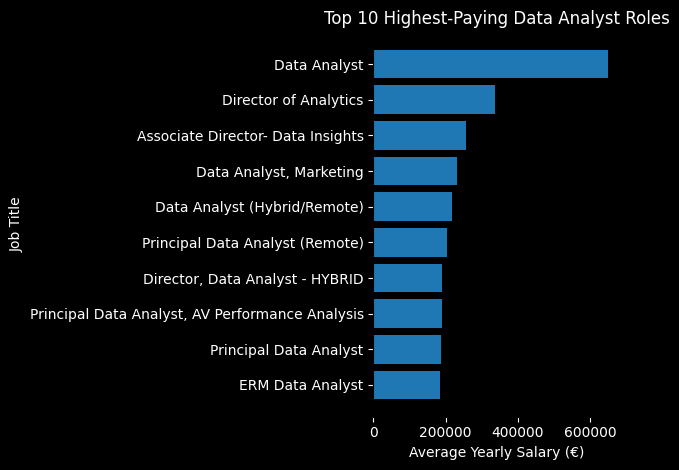
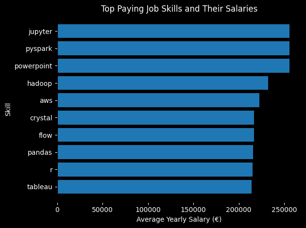

# Introduction
Welcome to my SQL portfolio project, where I researched the data job market focusing on data analysis jobs. The project takes a closer look at the top-paying roles in data analytics, the most demanded skills and the overlap between high demand and high salaries.

To check the SQL queries, please click on: [project_sql folder](/project/).

# Background
Looking for a job can be challenging as there is a large amount of information to consider before making a decision. By storing all the data of different jobs in a single dataset, I was able to analyze the data thoroughly and identify the best paying jobs as well as the needed skills to apply for these jobs.

The data for this analysis if from Luke Barusse's SQL Course, where all the information about the jobs and required squills are stored: <https://www.lukebarousse.com/products/sql-for-data-analytics/categories/2157430710/posts/2186736147>. 

The questions that has been answered are: 
1. What are the top-paying jobs for data analysts?
2. What skills are required for these top-paying jobs?
3. What skills are most in demand for data analysis?
4. Which skills are associated with higher salaries?
5. What are the most optimal skills to learn for a data analyst looking to maximize job market value?

# Tools I Used
For this project, four different tools have been used to conduct the analysis:

- **SQL**: used to query, clean and analyse the data. SQL was essential to filter the jobs, join multiple tables, aggregate series and identify the skills and salaries needed to answer the research questions.

- **Visual Studio Code**: used to write and organize the SQL queries. Together with the database, Visual Studio Code was used to run queries, manage files and structure the project.

- **PostgreSQL**: used as the database management system to store, manipulate and proces the data. 

- **Git and GitHub**: used for version control and collaboration. Git tracked the changes made in the data while GitHub stored the repository, documented the analysis and shared the project.

# The Analysis
This analysis examined the relationship between skill demand and salary for Data Analyst roles, highlighting skills that are both frequently requested and associated with higher-paying positions.

### 1. What are the top-paying jobs for data analysts?

To identify the highest paying roles, we filtered our data by specifying the role we wanted to analyze, Data Analyst, and by removing the NULL values of the salaries, focusing on remote jobs.

```sql
SELECT
    job_title,
    salary_year_avg,
    job_id,
    job_posted_date,
    job_location,
    job_work_from_home,
    company_dim.name

FROM 
    job_postings_fact
LEFT JOIN company_dim ON job_postings_fact.company_id = company_dim.company_id

WHERE
job_title_short = 'Data Analyst' AND 
job_work_from_home = 'True' AND
salary_year_avg IS NOT NULL

ORDER BY salary_year_avg DESC

LIMIT 10
```

The breakdown of the top data analyst jobs in 2023 are:
- The salaries of the top 10 highest-paying roles range from €184,000 to €650,000.
- These roles are spread across a variety of industries.
- Job titles vary widely, ranging from Data Analyst to Director of Data Analytics.


*The image shows the 10 top paying skills and their average yearly salary. This chart was made by ChatGPT from my SQL-query results.*

### 2. What skills are required for these top-paying jobs?

To identify the skills that are needed to apply for these highest paying roles, we again filtered our data by specifying the role we wanted to analyze, Data Analyst, focusing on remote jobs.

```sql
WITH highest_salaries AS(
    SELECT
    job_postings_fact.job_id,
    job_title,
    job_title_short,
    job_postings_fact.salary_year_avg

    FROM job_postings_fact

    WHERE salary_year_avg IS NOT NULL AND
    job_title_short = 'Data Analyst' AND
    job_work_from_home = 'True'

    ORDER BY salary_year_avg DESC

)

SELECT
highest_salaries.job_title,
highest_salaries.job_id,
highest_salaries.salary_year_avg,
company_dim.name,
STRING_AGG(skills_dim.skill_id::text, ',') AS skill_ids,
STRING_AGG(skills_dim.skills, ',') AS skill

FROM highest_salaries
LEFT JOIN job_postings_fact ON highest_salaries.job_id = job_postings_fact.job_id
LEFT JOIN company_dim ON job_postings_fact.company_id = company_dim.company_id
LEFT JOIN skills_job_dim ON highest_salaries.job_id = skills_job_dim.job_id
LEFT JOIN skills_dim ON skills_job_dim.skill_id = skills_dim.skill_id


WHERE skills_dim.skill_id IS NOT NULL

GROUP BY
highest_salaries.job_title,
highest_salaries.job_id,
highest_salaries.salary_year_avg,
company_dim.name

ORDER BY highest_salaries.salary_year_avg DESC 

LIMIT 10

```

The breakdown of the top data analyst skills in 2023 are:
- The salaries of the top 10 highest-paying skills range from €210000,000 to €250,000.
- The highest payed skill is Jupyter, closely followed by Pyspark and Powerpoint.



*The image shows the 10 top paying skills and their average yearly salary. This chart was made by ChatGPT from my SQL-query results.*


### 3. What skills are most in demand for data analysis?
In order to answer this question, we filtered the data based on the analyst role  combined with the 10 skills that aree the most for these jobs.

```sql

WITH max_salary_per_skill AS (
    SELECT
    MAX(job_postings_fact.salary_year_avg),
    skills_job_dim.skill_id

    FROM job_postings_fact
    LEFT JOIN skills_job_dim ON job_postings_fact.job_id = skills_job_dim.job_id

    WHERE job_postings_fact.salary_year_avg IS NOT NULL AND
    skills_job_dim.skill_id IS NOT NULL

    GROUP BY
    skills_job_dim.skill_id

    ORDER BY MAX(job_postings_fact.salary_year_avg) DESC
), 

skills_data_analyst AS(
    SELECT
    skills_job_dim.skill_id,
    COUNT(skills_job_dim.skill_id) AS total_skills

    FROM skills_job_dim
    LEFT JOIN job_postings_fact ON skills_job_dim.job_id = job_postings_fact.job_id

    WHERE job_postings_fact.job_work_from_home = 'TRUE' AND
    job_postings_fact.job_title_short = 'Data Analyst'

    GROUP BY skills_job_dim.skill_id

    ORDER BY total_skills DESC
)

SELECT
skills_data_analyst.skill_id,
skills_data_analyst.total_skills,
skills_dim.skills

FROM skills_data_analyst
INNER JOIN skills_dim ON skills_data_analyst.skill_id = skills_dim.skill_id

ORDER BY total_skills DESC

```


### 4. Which skills are associated with higher salaries?


### 5. What are the most optimal skills to learn for a data analyst looking to maximize job market value?

# What I learned

# Conclusions

[def]: assets/output.png